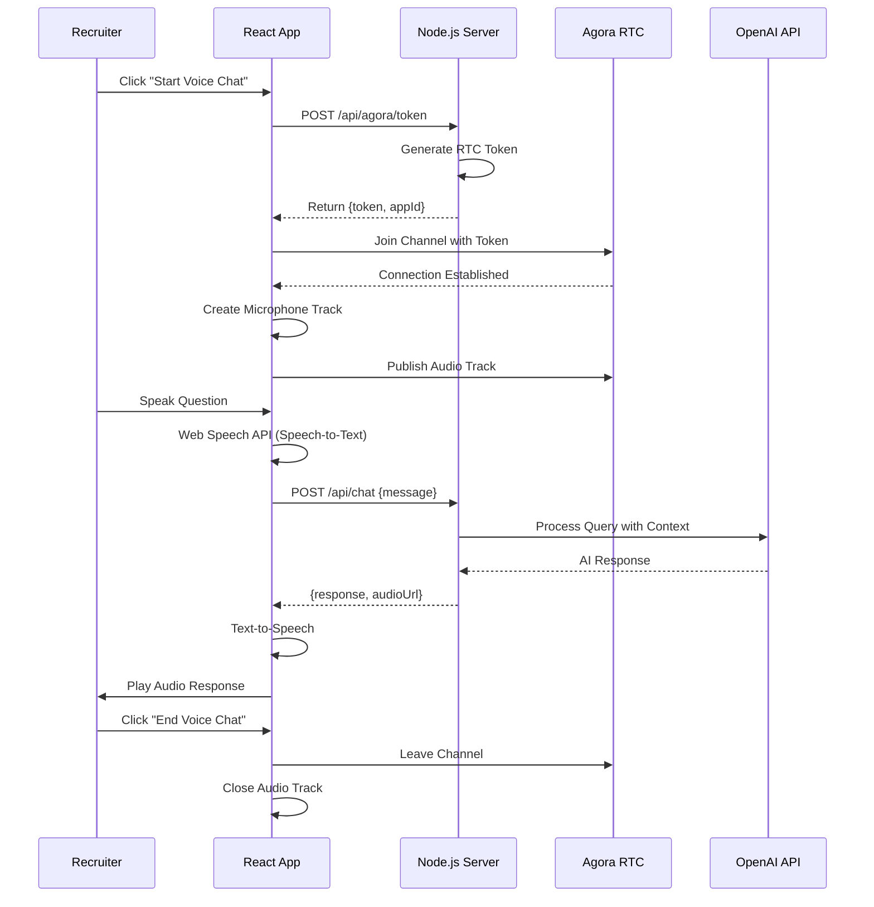
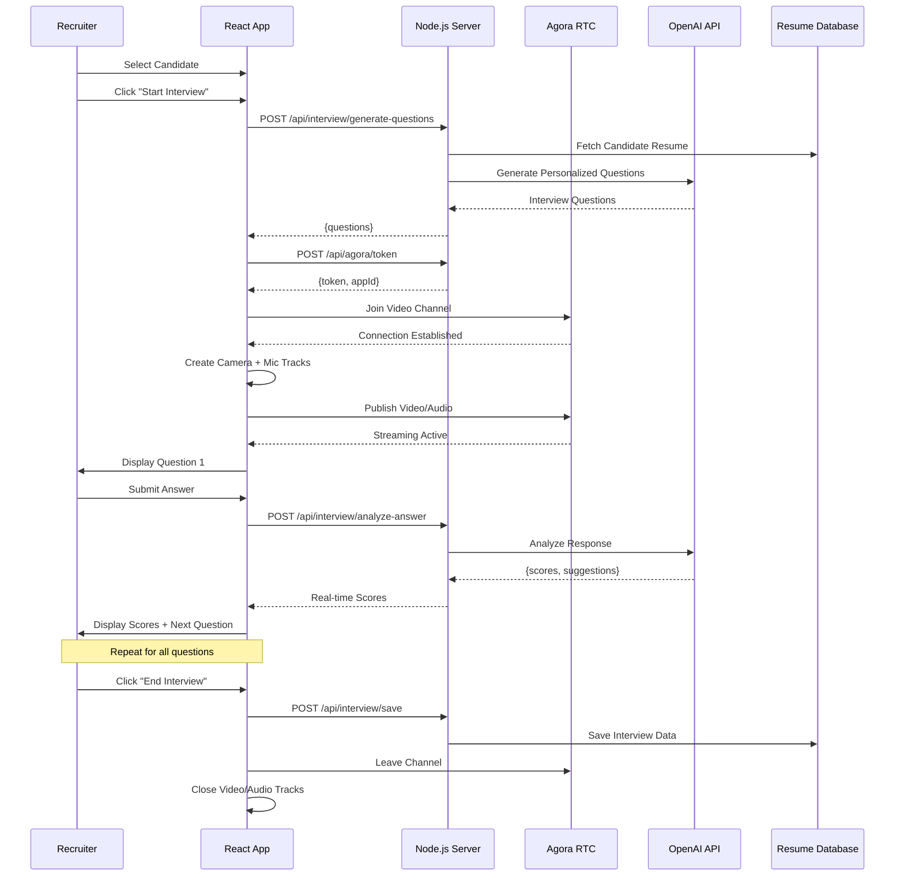
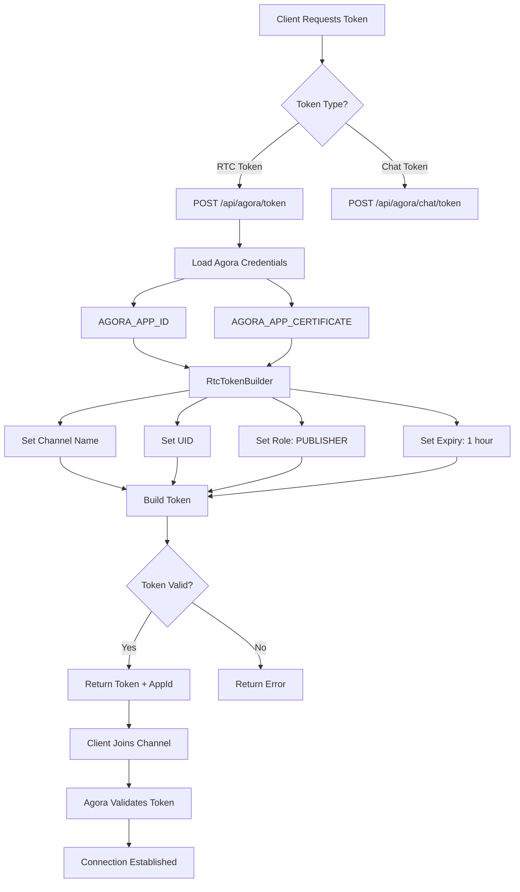
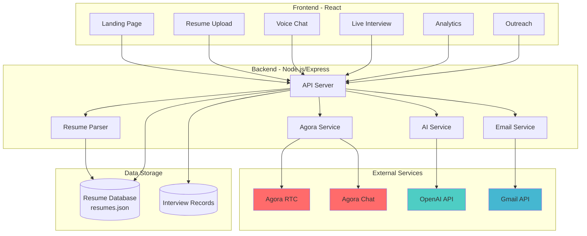
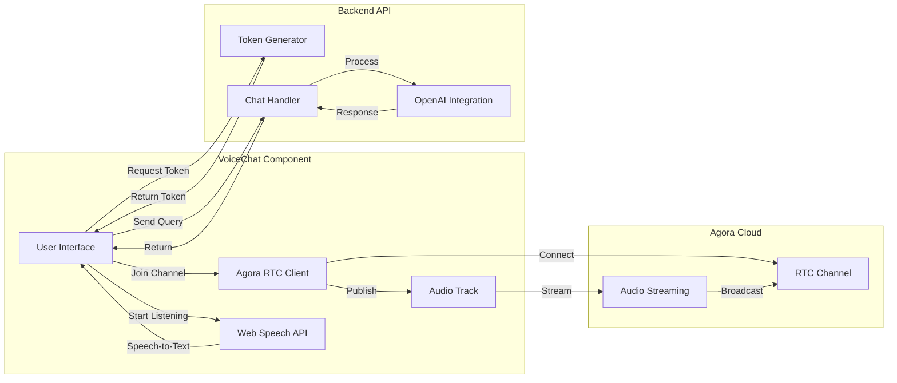
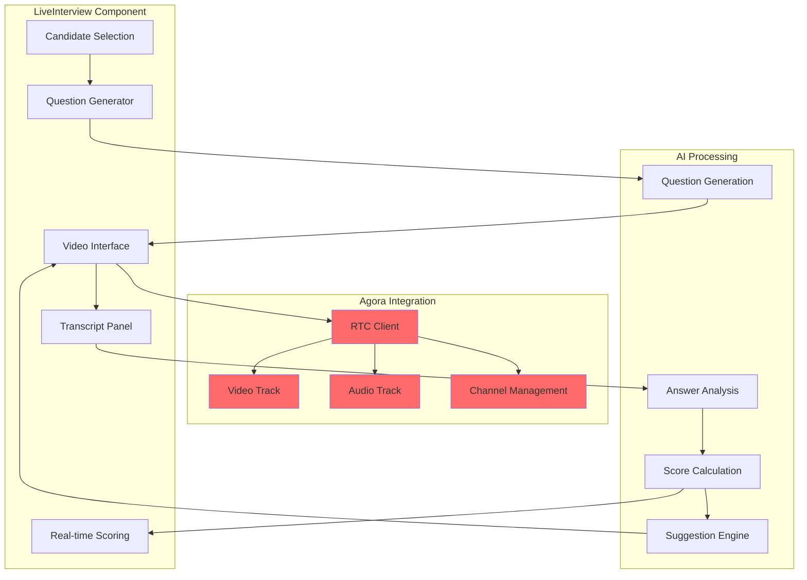
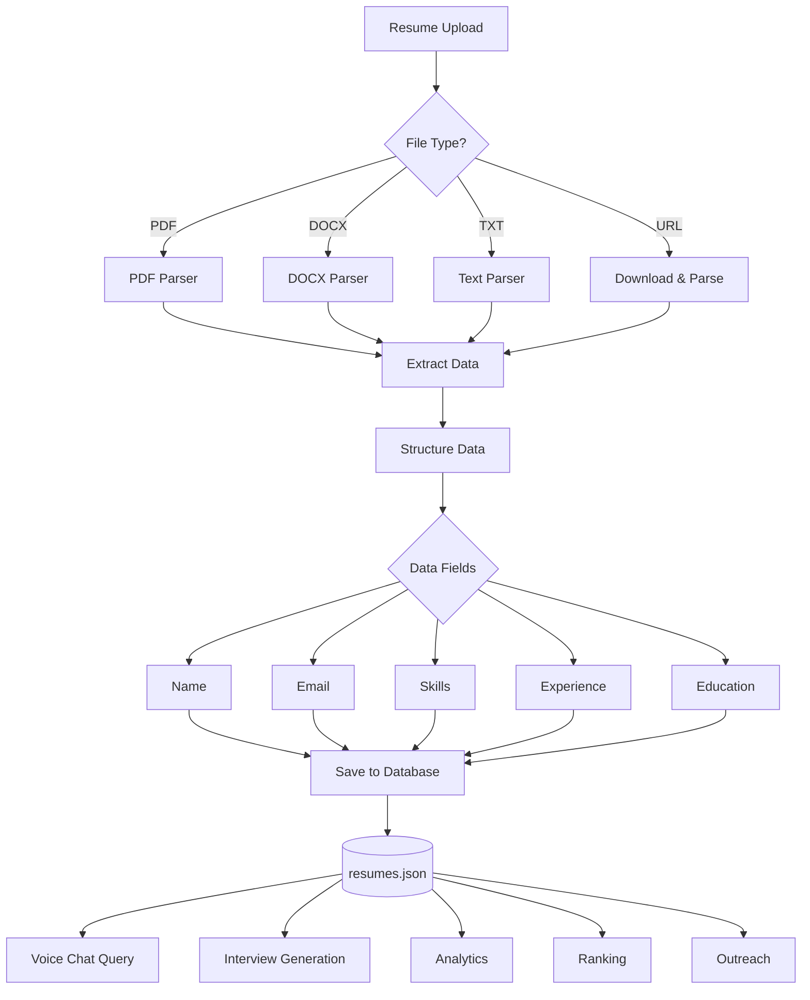
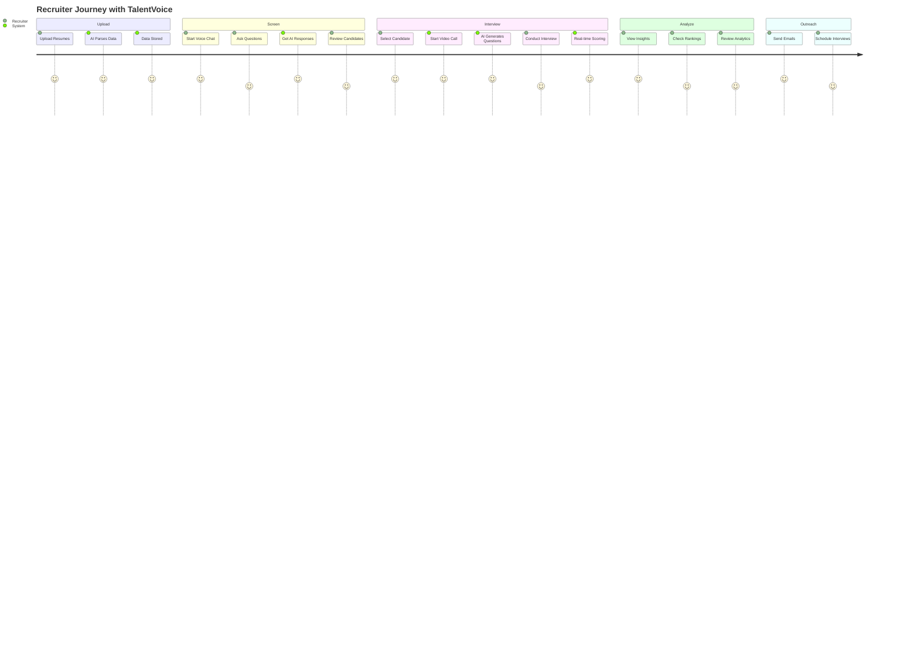
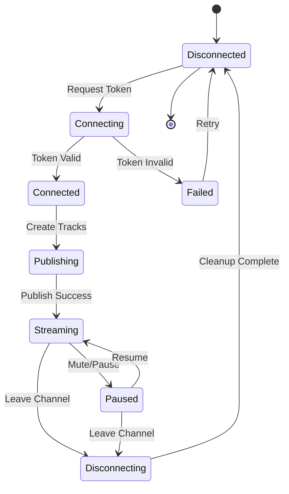
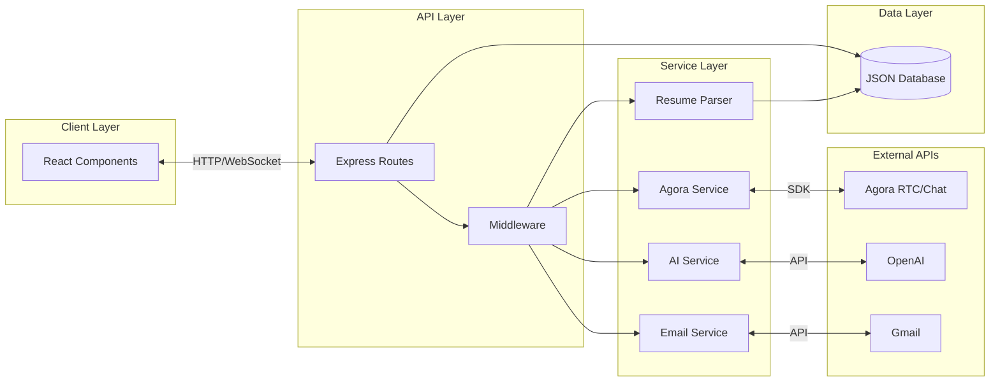

# 🎯 Agora Flow Diagrams

## 1. Agora Voice Chat Flow

---

## 2. Agora Video Interview Flow

---

## 3. Agora Token Generation Flow

---

## 4. Complete System Architecture

---

## 5. Voice Chat Component Architecture

---

## 6. Live Interview Component Architecture

---

## 7. Data Flow Architecture

---

## 8. End-to-End User Journey

---

## 9. Agora RTC Connection States

---

## 10. System Component Interaction

---

## Usage in Presentations

These diagrams can be rendered in:
- **GitHub**: Automatically renders Mermaid
- **VS Code**: Install "Markdown Preview Mermaid Support" extension
- **Online**: https://mermaid.live/
- **PowerPoint**: Export as PNG/SVG from mermaid.live

Copy any diagram code and paste into mermaid.live for instant visualization!
