# 🎤 Agora Voice Chat Integration Flow

## 1. Complete Voice Chat Flow (Detailed)

```mermaid
sequenceDiagram
    participant Recruiter
    participant UI as React UI<br/>(VoiceChat.jsx)
    participant Speech as Web Speech API
    participant Backend as Node.js Server
    participant Agora as Agora RTC Cloud
    participant OpenAI as OpenAI GPT-4
    participant DB as Resume Database

    Note over Recruiter,DB: 🎯 INITIALIZATION PHASE
    
    Recruiter->>UI: Click "Start Voice Chat"
    UI->>UI: Initialize Agora Client<br/>AgoraRTC.createClient()
    
    UI->>Backend: POST /api/agora/token<br/>{channelName: "resume-screening"}
    
    Backend->>Backend: Load Credentials<br/>AGORA_APP_ID<br/>AGORA_APP_CERTIFICATE
    Backend->>Backend: Generate RTC Token<br/>RtcTokenBuilder.buildTokenWithUid()
    Backend->>Backend: Set Expiry: 1 hour<br/>Role: PUBLISHER
    
    Backend-->>UI: {token, appId}
    
    Note over Recruiter,DB: 🔗 CONNECTION PHASE
    
    UI->>Agora: client.join(appId, channel, token)
    Agora-->>UI: ✅ Connection Established
    
    UI->>UI: Create Microphone Track<br/>AgoraRTC.createMicrophoneAudioTrack()
    UI->>Agora: client.publish([audioTrack])
    Agora-->>UI: ✅ Audio Published
    
    UI->>Speech: Initialize Speech Recognition<br/>new SpeechRecognition()
    UI->>Speech: recognition.start()
    
    UI-->>Recruiter: 🎤 "Listening... Speak your question"
    
    Note over Recruiter,DB: 🗣️ VOICE QUERY PHASE
    
    Recruiter->>Speech: Speaks: "Who has React experience?"
    Speech->>Speech: Continuous Recognition<br/>interimResults: true
    Speech->>UI: onresult event<br/>transcript: "Who has React experience?"
    
    UI-->>Recruiter: Display: "You're saying: Who has..."
    
    Speech->>UI: Final Transcript<br/>isFinal: true
    
    UI->>Backend: POST /api/chat<br/>{message: "Who has React experience?"}
    
    Note over Recruiter,DB: 🤖 AI PROCESSING PHASE
    
    Backend->>DB: Load Resume Database<br/>getResumesFromFile()
    DB-->>Backend: Array of Resumes
    
    Backend->>Backend: Build Context<br/>Map candidates with skills
    
    Backend->>OpenAI: POST /v1/chat/completions<br/>{<br/>  model: "gpt-4",<br/>  messages: [system, user],<br/>  context: resume_data<br/>}
    
    OpenAI->>OpenAI: Analyze Query<br/>Match Skills<br/>Rank Candidates
    
    OpenAI-->>Backend: AI Response:<br/>"Found 3 candidates with React..."
    
    Backend-->>UI: {<br/>  response: "Found 3 candidates...",<br/>  audioUrl: null<br/>}
    
    Note over Recruiter,DB: 🔊 AUDIO RESPONSE PHASE
    
    UI->>UI: Check for Google TTS Audio
    
    alt Google TTS Available
        UI->>UI: Play Audio File
    else Browser TTS
        UI->>UI: speechSynthesis.speak()<br/>Select Natural Voice<br/>Rate: 0.95, Pitch: 1.1
    end
    
    UI-->>Recruiter: 🔊 Plays Audio Response
    UI-->>Recruiter: 💬 Displays Text Response
    
    Note over Recruiter,DB: 🔄 CONTINUOUS CONVERSATION
    
    Recruiter->>Speech: Speaks: "Show me their experience"
    Speech->>UI: New Transcript
    UI->>Backend: POST /api/chat (Follow-up)
    Backend->>OpenAI: Process with Context
    OpenAI-->>Backend: Detailed Response
    Backend-->>UI: Response
    UI-->>Recruiter: Audio + Text Response
    
    Note over Recruiter,DB: 🛑 TERMINATION PHASE
    
    Recruiter->>UI: Click "End Voice Chat"
    
    UI->>Speech: recognition.stop()
    UI->>UI: speechSynthesis.cancel()
    UI->>UI: audioTrack.close()
    UI->>Agora: client.leave()
    
    Agora-->>UI: ✅ Disconnected
    UI-->>Recruiter: "Disconnected"
```



---

## 2. Agora Voice Chat Architecture


---

## 3. Token Generation Flow

```mermaid
flowchart TD
    A[User Clicks<br/>"Start Voice Chat"] --> B[Frontend Requests Token]
    
    B --> C[POST /api/agora/token]
    
    C --> D{Credentials<br/>Configured?}
    
    D -->|No| E[❌ Error:<br/>"Agora credentials not configured"]
    D -->|Yes| F[Load Environment Variables]
    
    F --> G[AGORA_APP_ID]
    F --> H[AGORA_APP_CERTIFICATE]
    
    G --> I[RtcTokenBuilder]
    H --> I
    
    I --> J[Set Parameters]
    J --> K[Channel: "resume-screening"]
    J --> L[UID: 0 auto-assign]
    J --> M[Role: PUBLISHER]
    J --> N[Expiry: 3600 seconds]
    
    K --> O[Build Token]
    L --> O
    M --> O
    N --> O
    
    O --> P{Token Valid?}
    
    P -->|Yes| Q[✅ Return Token + AppId]
    P -->|No| R[❌ Error: Token generation failed]
    
    Q --> S[Frontend Receives Token]
    S --> T[Join Agora Channel]
    T --> U[✅ Connected]
    
    style U fill:#4caf50,color:#fff
    style E fill:#f44336,color:#fff
    style R fill:#f44336,color:#fff
```

---

## 4. Speech Recognition Flow


---

## 5. Audio Track Management


---

## 6. Voice Chat Component Lifecycle


---

## 7. Error Handling Flow

```mermaid
flowchart TD
    A[Voice Chat Operation] --> B{Error Occurs?}
    
    B -->|No| C[✅ Success]
    B -->|Yes| D{Error Type?}
    
    D -->|Token Error| E[Credentials Not Configured]
    D -->|Network Error| F[Connection Failed]
    D -->|Permission Error| G[Microphone Access Denied]
    D -->|Speech API Error| H[Browser Not Supported]
    D -->|Agora Error| I[Channel Join Failed]
    
    E --> J[Show Error Message:<br/>"Configure Agora credentials"]
    F --> K[Show Error Message:<br/>"Check internet connection"]
    G --> L[Show Error Message:<br/>"Allow microphone access"]
    H --> M[Show Error Message:<br/>"Use Chrome browser"]
    I --> N[Show Error Message:<br/>"Try again later"]
    
    J --> O[Log Error]
    K --> O
    L --> O
    M --> O
    N --> O
    
    O --> P[Update UI State]
    P --> Q[Enable Retry]
    
    style E fill:#ff5252
    style F fill:#ff5252
    style G fill:#ff5252
    style H fill:#ff5252
    style I fill:#ff5252
```

---

## 8. Data Flow in Voice Chat

```mermaid
graph LR
    subgraph "Input"
        A[👤 User Voice]
    end
    
    subgraph "Processing Pipeline"
        B[🎤 Microphone]
        C[📡 Agora RTC]
        D[🗣️ Speech-to-Text]
        E[📝 Text Query]
        F[🤖 AI Processing]
        G[💬 Text Response]
        H[🔊 Text-to-Speech]
    end
    
    subgraph "Output"
        I[🔊 Audio Response]
        J[💬 Text Display]
    end
    
    A --> B
    B --> C
    C --> D
    D --> E
    E --> F
    F --> G
    G --> H
    H --> I
    G --> J
    
    style F fill:#4ecdc4
    style C fill:#ff6b6b
```



---

## 9. Agora vs Traditional Voice Chat


---

## 10. Voice Chat Features


---

## 11. Implementation Code Flow


---

## Usage Instructions

### For Presentations:
1. Copy any diagram to https://mermaid.live/
2. Customize colors if needed
3. Export as PNG/SVG (high resolution)
4. Insert into PowerPoint

### For Documentation:
- These render automatically on GitHub
- Use in README.md or technical docs
- Great for onboarding new developers

### Key Points to Highlight:
- ⚡ Real-time communication via Agora
- 🎤 Hands-free voice interaction
- 🤖 AI-powered responses
- 🔊 Natural text-to-speech
- 🌐 Global low-latency network

Perfect for technical presentations! 🚀
