# 🎯 TalentVoice - Complete System Diagrams

## 1. Complete System Architecture

```mermaid
graph TB
    subgraph "Frontend Features"
        A[📤 Upload Center]
        B[📊 Candidate Ranking]
        C[🧠 AI Insights]
        D[🎥 Live Interview]
        E[💬 AI Chat]
        F[🎤 Voice Chat]
        G[📧 Email Outreach]
        H[📈 Dashboard]
        I[🔗 Integrations]
    end
    
    subgraph "Backend Services"
        J[Resume Parser]
        K[Agora RTC Service]
        L[OpenAI Service]
        M[Email Service]
        N[Analytics Engine]
        O[Ranking Algorithm]
    end
    
    subgraph "External APIs"
        P[Agora RTC/Chat]
        Q[OpenAI GPT-4]
        R[Gmail API]
    end
    
    subgraph "Data Layer"
        S[(Resume Database)]
        T[(Interview Records)]
        U[(Analytics Data)]
    end
    
    A --> J
    B --> O
    C --> L
    D --> K
    E --> L
    F --> K
    G --> M
    H --> N
    I --> M
    
    J --> S
    K --> P
    L --> Q
    M --> R
    N --> U
    O --> S
    
    K --> T
    L --> S
    
    style P fill:#ff6b6b
    style Q fill:#4ecdc4
    style R fill:#45b7d1
```

---

## 2. Feature Flow - Complete User Journey

```mermaid
flowchart TD
    Start([Recruiter Logs In]) --> A[📤 Upload Center]
    
    A --> A1[Upload Resume PDF/DOCX]
    A --> A2[Upload via Google Drive Link]
    A --> A3[Bulk Upload Multiple Files]
    
    A1 --> Parse[AI Parses Resume]
    A2 --> Parse
    A3 --> Parse
    
    Parse --> DB[(Resume Database)]
    
    DB --> B[📊 Candidate Ranking]
    B --> B1[Rank by Experience]
    B --> B2[Rank by Skills Match]
    B --> B3[Rank by Activity Score]
    
    DB --> C[🧠 AI Insights]
    C --> C1[Psychological Profile]
    C --> C2[Culture Fit Score]
    C --> C3[Leadership Potential]
    
    DB --> E[💬 AI Chat]
    E --> E1[Text-based Queries]
    E1 --> E2[Get Instant Answers]
    
    DB --> F[🎤 Voice Chat]
    F --> F1[Hands-free Screening]
    F1 --> F2[Voice Responses]
    
    B --> D[🎥 Live Interview]
    C --> D
    
    D --> D1[Video Call via Agora]
    D1 --> D2[Real-time AI Scoring]
    D2 --> D3[Interview Transcript]
    
    D3 --> G[📧 Email Outreach]
    B --> G
    
    G --> G1[Send Interview Invites]
    G --> G2[Bulk Email Campaigns]
    G --> G3[Automated Follow-ups]
    
    B --> H[📈 Dashboard]
    C --> H
    D --> H
    
    H --> H1[View Analytics]
    H --> H2[Track Metrics]
    H --> H3[Generate Reports]
    
    G --> I[🔗 Integrations]
    I --> I1[Career Page Widget]
    I --> I2[API Access]
    I --> I3[Webhook Notifications]
    
    style A fill:#e1f5ff
    style B fill:#fff3e0
    style C fill:#f3e5f5
    style D fill:#ffebee
    style E fill:#e8f5e9
    style F fill:#fff9c4
    style G fill:#fce4ec
    style H fill:#e0f2f1
    style I fill:#f1f8e9
```

---

## 3. Upload Center - Detailed Flow

---

## 4. Candidate Ranking System

---

## 5. AI Insights Generation

---

## 6. Live Interview - Complete Flow

---

## 7. AI Chat vs Voice Chat

---

## 8. Email Outreach System

```mermaid
flowchart TD
    A[📧 Email Outreach] --> B{Outreach Type?}
    
    B -->|Single| C[Select Candidate]
    B -->|Bulk| D[Search Candidates]
    
    C --> E[Compose Email]
    D --> F[Select Multiple]
    F --> G[Create Template]
    
    E --> H[Personalize Content]
    G --> I[Add Variables]
    I --> J[name, skills, etc.]
    
    H --> K[Gmail API]
    J --> K
    
    K --> L{Email Service?}
    
    L -->|Gmail| M[Send via Gmail]
    L -->|SendGrid| N[Send via SendGrid]
    
    M --> O[Track Delivery]
    N --> O
    
    O --> P[Update Database]
    P --> Q[Show Success]
    
    Q --> R[📈 Dashboard]
    R --> S[Track Email Metrics]
```

---

## 9. Dashboard Analytics

---

## 10. Integration System

```mermaid
flowchart TB
    A[🔗 Integrations] --> B[Career Page Widget]
    A --> C[API Access]
    A --> D[Webhooks]
    
    B --> B1[Generate Embed Code]
    B1 --> B2[Copy to Website]
    B2 --> B3[Candidates Apply]
    B3 --> B4[Auto-Import to System]
    
    C --> C1[Generate API Key]
    C1 --> C2[API Documentation]
    C2 --> C3[Third-party Integration]
    
    D --> D1[Configure Webhook URL]
    D1 --> D2[Select Events]
    D2 --> D3[New Application]
    D2 --> D4[Interview Complete]
    D2 --> D5[Candidate Ranked]
    
    D3 --> D6[POST to Webhook]
    D4 --> D6
    D5 --> D6
```

---

## 11. Complete Data Flow

```mermaid
flowchart TD
    Start([Resume Upload]) --> Parse[Parse Resume]
    
    Parse --> DB[(Central Database)]
    
    DB --> Feature1[📊 Ranking]
    DB --> Feature2[🧠 Insights]
    DB --> Feature3[💬 AI Chat]
    DB --> Feature4[🎤 Voice Chat]
    DB --> Feature5[🎥 Interview]
    
    Feature1 --> Dashboard[📈 Dashboard]
    Feature2 --> Dashboard
    Feature5 --> Dashboard
    
    Feature1 --> Outreach[📧 Outreach]
    Feature2 --> Outreach
    
    Dashboard --> Analytics[Analytics Data]
    Outreach --> EmailLogs[Email Logs]
    Feature5 --> InterviewData[Interview Records]
    
    Analytics --> Reports[📊 Reports]
    EmailLogs --> Reports
    InterviewData --> Reports
    
    Reports --> Export[Export/Share]
```

---

## 12. Technology Stack

---

## 13. Feature Interaction Map

---

## 14. Agora Implementation Layers

---

## 15. Security & Performance

---

## Usage Instructions

### For PowerPoint Presentations:
1. Visit https://mermaid.live/
2. Copy any diagram code
3. Paste and render
4. Download as PNG/SVG
5. Insert into slides

### For Documentation:
- GitHub automatically renders Mermaid
- VS Code: Install "Markdown Preview Mermaid Support"
- Notion: Use Mermaid blocks

### For Reports:
- Export high-resolution images
- Use SVG for scalability
- Customize colors in mermaid.live

All diagrams are production-ready and presentation-optimized! 🚀
