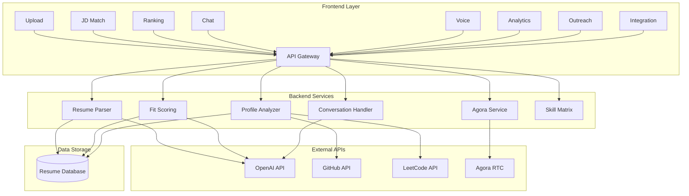
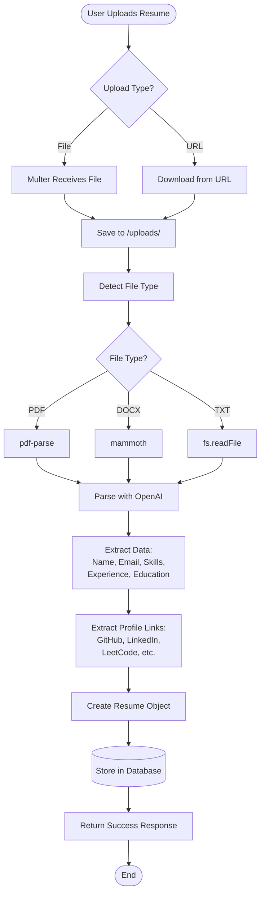
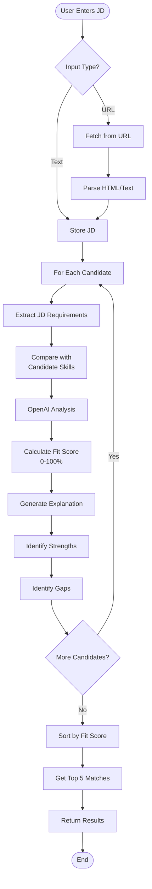
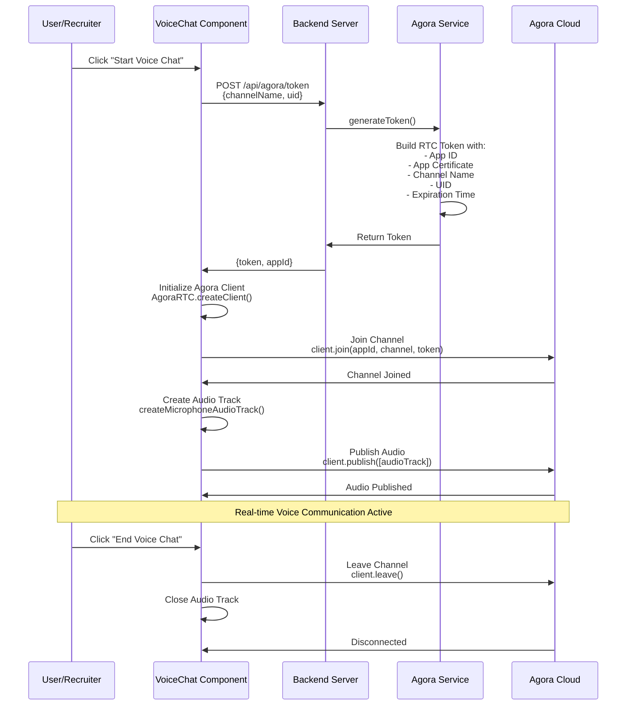
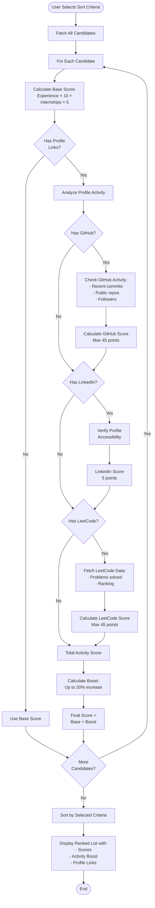
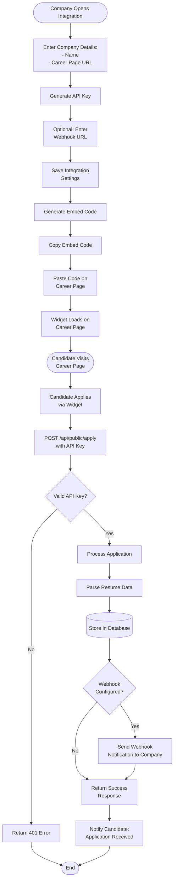
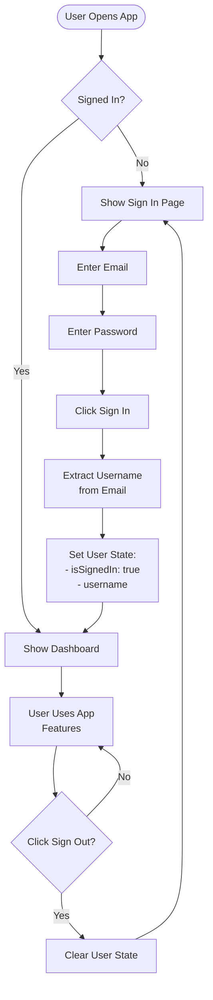
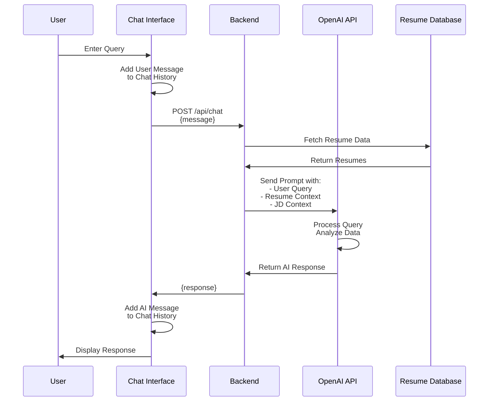
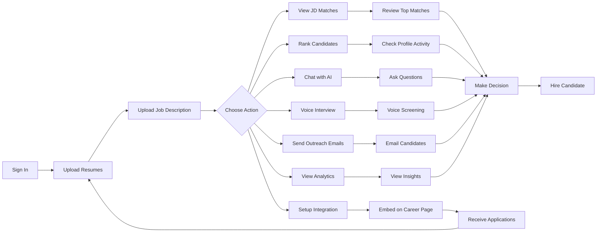
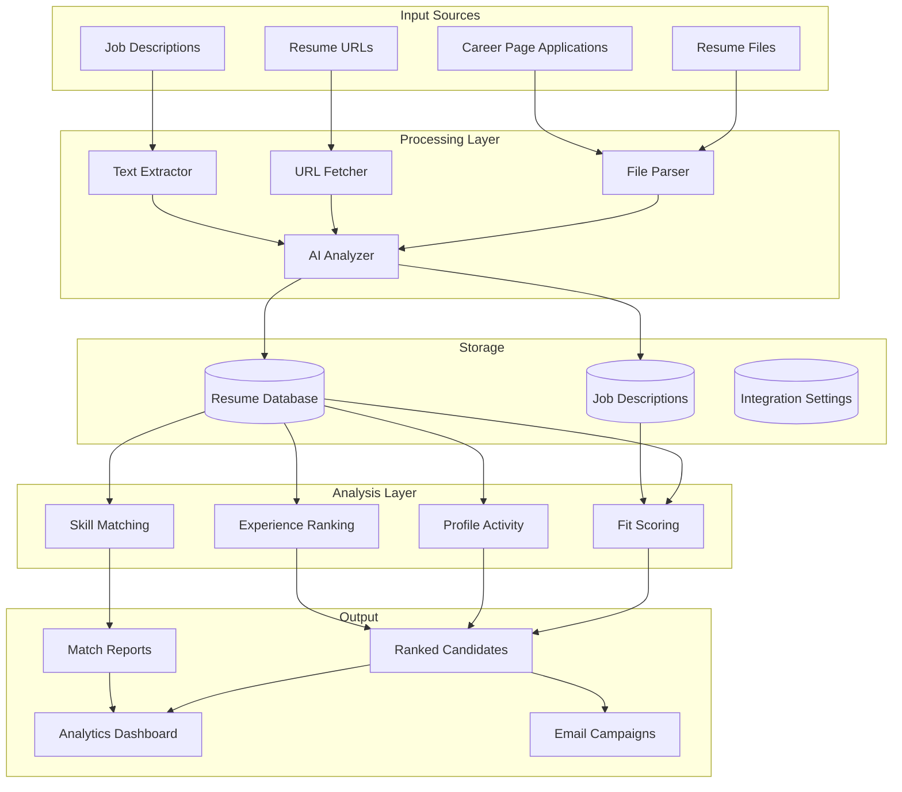

# TalentVoice - Mermaid Flow Diagrams

Copy these diagrams to [mermaid.live](https://mermaid.live) to visualize them.

## 1. System Architecture



## 2. Resume Upload Flow




## 3. Job Description Matching Flow



## 4. Agora Voice Chat Integration Flow




## 5. Candidate Ranking with Profile Activity Flow




## 6. Candidate Outreach Email Flow

```mermaid
flowchart TD
    Start([User Opens Outreach]) --> LoadJD{Load JD?}
    
    LoadJD -->|Load Uploaded| FetchJD[Fetch Stored JD<br/>from Database]
    LoadJD -->|Manual Entry| EnterJD[User Enters JD]
    
    FetchJD --> SelectTime[Select Time Range:<br/>1, 3, 6, or 12 months]
    EnterJD --> SelectTime
    
    SelectTime --> Search[Click Search Candidates]
    
    Search --> Filter[Filter Candidates by<br/>Upload Date]
    
    Filter --> Evaluate[Evaluate Filtered<br/>Candidates vs JD]
    
    Evaluate --> Match[Get Matches with<br/>60%+ Fit Score]
    
    Match --> Display[Display Matching<br/>Candidates]
    
    Display --> Select[User Selects<br/>Candidates]
    
    Select --> Template[Auto-generate<br/>Email Template with:<br/>- Subject<br/>- JD Description<br/>- Availability Request]
    
    Template --> Customize[User Customizes<br/>Email if Needed]
    
    Customize --> Send[Click Send Emails]
    
    Send --> Loop[For Each Selected<br/>Candidate]
    
    Loop --> CheckEmail{Has Email?}
    
    CheckEmail -->|No| Skip[Skip Candidate]
    CheckEmail -->|Yes| Personalize[Personalize Email:<br/>Replace {{name}}]
    
    Personalize --> SendEmail[Send Email via<br/>Email Service]
    
    SendEmail --> Count[Increment Sent Count]
    Skip --> More
    Count --> More{More<br/>Candidates?}
    
    More -->|Yes| Loop
    More -->|No| Success[Show Success Message:<br/>X emails sent]
    
    Success --> End([End])
```


## 7. Career Page Integration Flow




## 8. User Authentication Flow



## 9. Chat Interface Flow




## 10. Complete User Journey



## 11. Data Flow Architecture



---

## How to Use These Diagrams

1. **Copy any diagram code** (including the triple backticks and `mermaid` keyword)
2. **Go to** [mermaid.live](https://mermaid.live)
3. **Paste the code** in the editor
4. **View the rendered diagram** on the right side
5. **Export** as PNG, SVG, or share the link

## Diagram Types Used

- **flowchart TD/LR**: Top-Down or Left-Right flowcharts
- **graph TB/LR**: Graph diagrams
- **sequenceDiagram**: Sequence/interaction diagrams

## Color Customization

You can add themes by adding this at the top of any diagram:

```mermaid
%%{init: {'theme':'dark'}}%%
```

Or use: `'theme':'forest'`, `'theme':'neutral'`, `'theme':'base'`

---

**Created for**: TalentVoice AI Recruitment Platform  
**Last Updated**: November 2024
